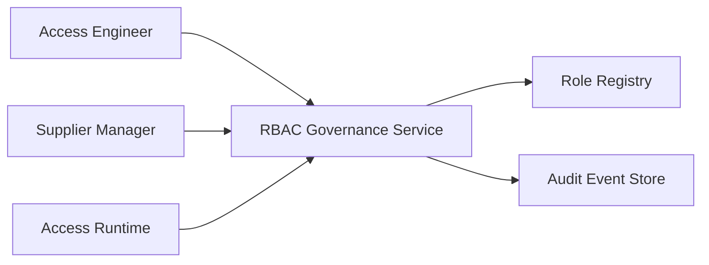
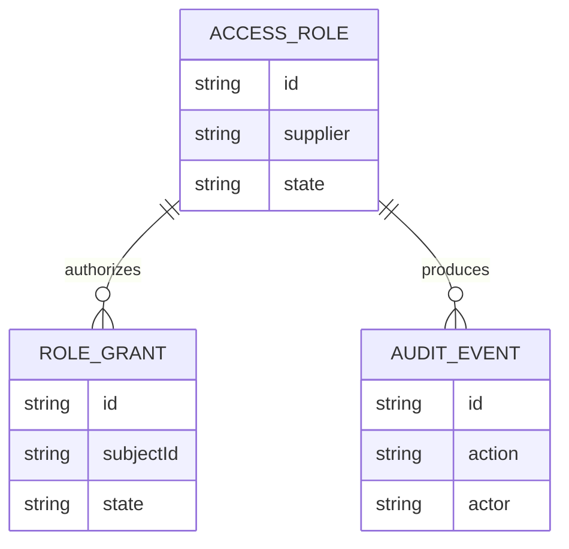
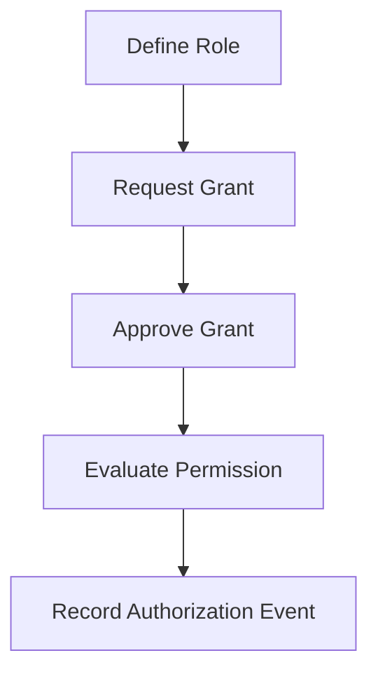
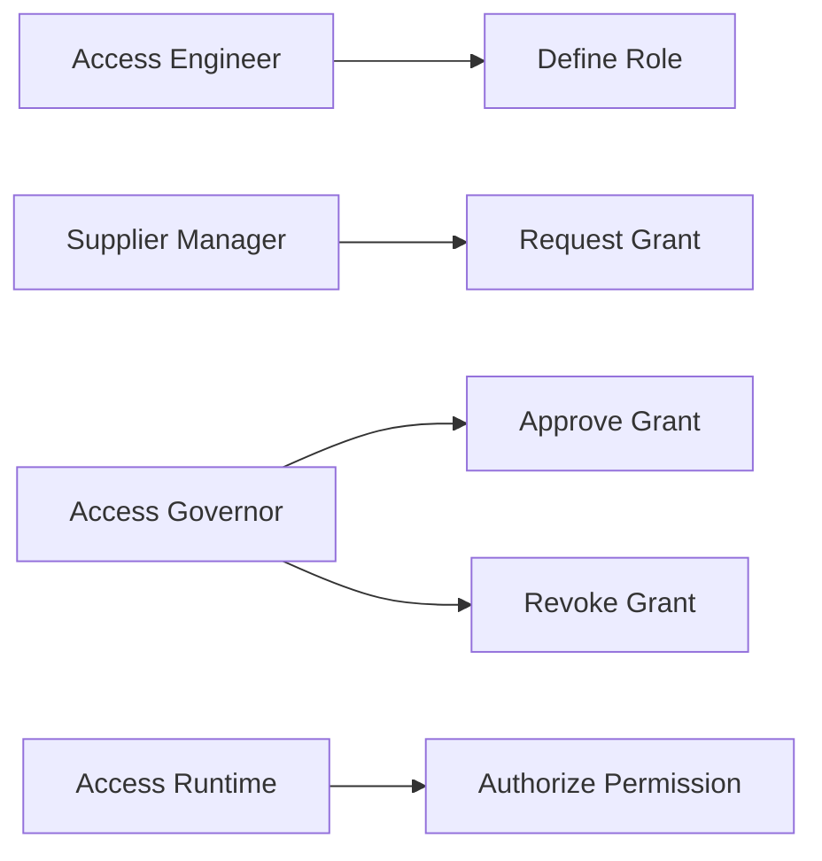
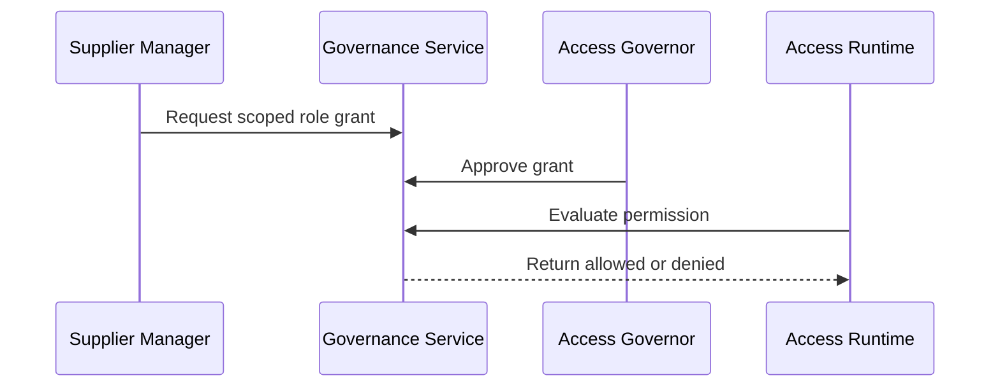

# RBAC Supplier Access Control Governance Platform

## The Problem
Supplier access can spread through informal requests, oversized permission bundles, and poorly documented approvals. This makes it difficult to demonstrate who can perform a business action and why that authority exists.

## The Solution
This service governs role based supplier access. Access engineers define permission bundles, supplier managers submit justified grant requests, access governors approve or revoke grants, and runtime authorization decisions are recorded for review.

## Live Demo & Tech Stack
The LAN health endpoint is available at `http://0.0.0.0:26300/health`. The implementation uses Node.js, Express, Vitest, GitHub Actions, and governed role based access control.

## Local Setup & Run Instructions
```bash
npm install
npm test
npm start
curl http://127.0.0.1:26300/health
```

## System Documentation (Mermaid.js)
### System Architecture Diagram

### Entity-Relationship Diagram (ERD)

### Data Flow Diagram

### Use Case Diagram

### Sequence Diagram


## Owner
Created and maintained by Kholipha Ahmmad Al-Amin.
Software Engineer and AI Specialist
Founder and CEO of EquiSaaS BD
Principal Consultant at AR IT Consultancy
Full Stack Developer and SaaS Product Builder
### Official links
Portfolio: https://kholipha-ahmmad-al-amin.equisaas-bd.com/
GitHub: https://github.com/kholipha-ahmmad-al-amin
LinkedIn: https://www.linkedin.com/in/kholipha-ahmmad-al-amin
X: https://x.com/al_amin5519
Facebook: https://www.facebook.com/kholipha.ahmmad.al.amin
Instagram: https://www.instagram.com/kholipha.ahmmad.al.amin
## Ownership
This project was created and is maintained by Kholipha Ahmmad Al-Amin.

